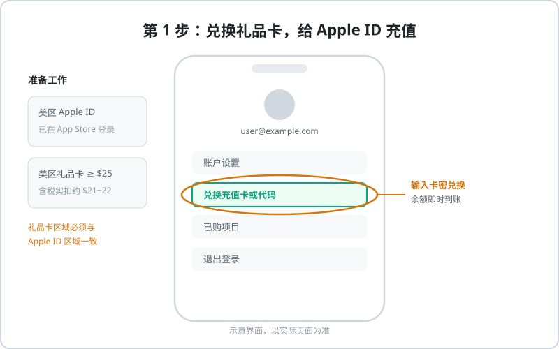
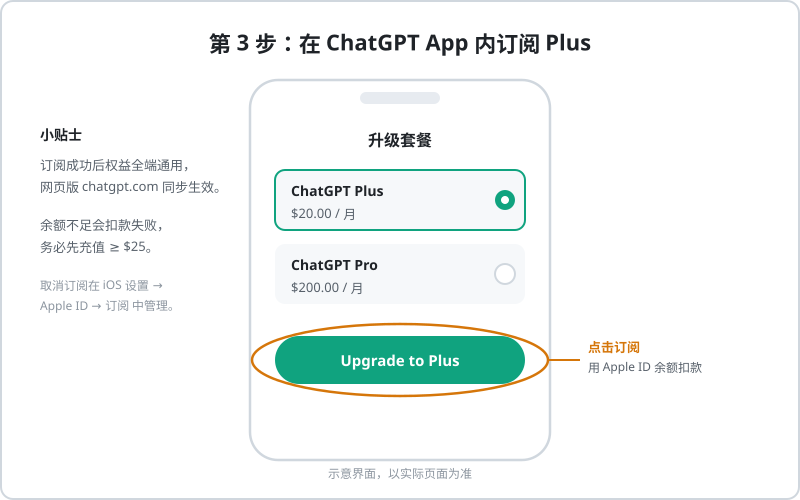
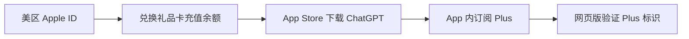

# 苹果礼品卡开通 ChatGPT Plus 教程

iOS 用户可以通过**美区 Apple ID + App Store 礼品卡**订阅 ChatGPT Plus，不需要海外信用卡。这是走 Apple 官方支付通道的方案，安全性高。

## 原理

ChatGPT 的 iOS 版支持 App Store 内购。只要你的 Apple ID 余额充足（用礼品卡充值），即可在 App 内完成订阅——相当于由 Apple 官方"代付"，权益与网页版完全通用。

## 准备工作

1. 一个**美区 Apple ID**（或其它支持 ChatGPT 内购的地区账号）
2. 美区 App Store 礼品卡，建议 **$25 起步**
3. iOS 设备上已登录该 Apple ID，并能正常访问 App Store

::: tip 为什么建议多充一点？
App Store 订阅会加收消费税（各州不同，一般 5%~10%），$20 的订阅实际扣款约 **$21~$22**。只充 $20 会扣款失败。
:::

## 完整流程

### 第 1 步：给 Apple ID 充值

打开 App Store → 点击右上角头像 → 选择 **兑换充值卡或代码**，输入礼品卡卡密，余额即时到账。

### 第 2 步：下载 ChatGPT 官方 App

在 App Store 搜索 **ChatGPT**（开发者 OpenAI），安装并登录你的账号。

### 第 3 步：在 App 内订阅 Plus

进入升级页面，选择 **Plus** 套餐 → 点击 **Upgrade to Plus** → 使用 Apple ID 余额完成扣款。

### 第 4 步：验证生效

订阅成功后，打开网页版 chatgpt.com 刷新，左下角同样显示 **Plus 标识**——权益是全端通用的。

## 避坑要点

- **礼品卡渠道要可靠**：来路不明的卡密可能已被盗刷，兑换失败且损失金额
- **区域必须一致**：美区礼品卡只能充美区 Apple ID，否则提示"此代码在您的账户中无效"
- **先充后订**：确认余额 ≥ $25 再订阅，避免扣款失败触发风控
- **取消订阅**：在 iOS 设置 → Apple ID → 订阅 中管理，当期权益保留至到期

::: tip 觉得折腾？
不想注册美区 ID、买礼品卡？充值中心支持微信/支付宝直接开通 Plus，几分钟到账。
👉 [前往 AI 服务充值中心](https://littlemagic8.github.io/gptplus/index.html)
:::

## 相关阅读

- [ChatGPT Plus 订阅教程（官方绑卡）](/chatgpt/recharge/plus)
- [Plus 与 Pro 区别对比](/chatgpt/recharge/plus-vs-pro)
- [微信/支付宝开通 Plus 教程](/chatgpt/recharge/gpt-daichong)
