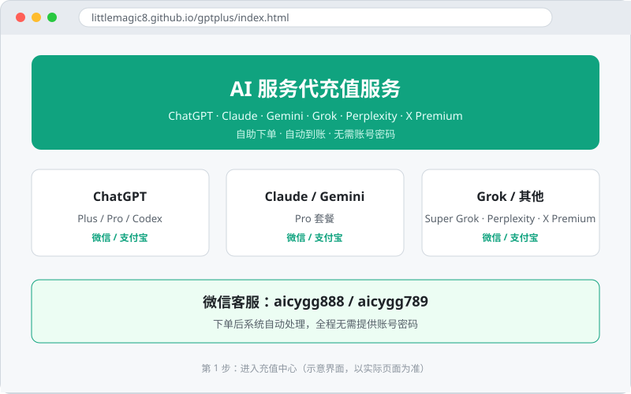
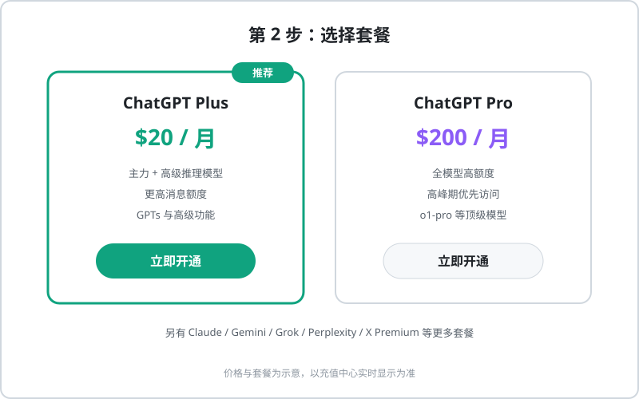
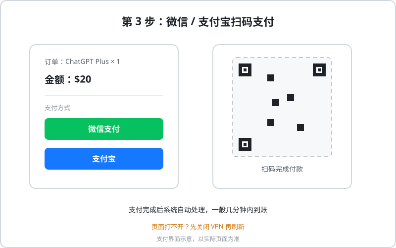
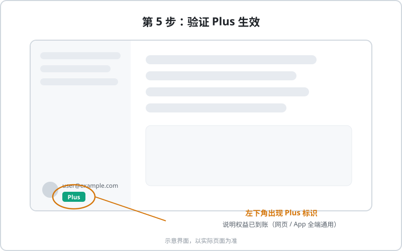

# 微信/支付宝开通 ChatGPT Plus 教程

没有海外信用卡、也不是 iOS 用户？**微信/支付宝自助充值**是目前国内用户开通 ChatGPT Plus 最省心的方式，全程 5 分钟左右，支付方式与国内网购一样简单。

## 两种服务形态，务必分清

| 形态 | 需要提供什么 | 风险 | 推荐度 |
|------|-------------|------|--------|
| 自助充值 | 仅账号绑定的邮箱/手机号 | 低 | ★★★★★ |
| 全托管代充 | 账号 + 密码 | 高（可能被封号） | 不推荐 |

::: danger 安全底线
无论通过哪种渠道，**永远不要提供账号密码和验证码**。正规的自助充值只需要你的注册邮箱，全程不需要登录你的账号。
:::

## 自助充值完整流程

### 第 1 步：进入充值中心

打开自助充值服务页：

👉 [AI 服务充值中心](https://littlemagic8.github.io/gptplus/index.html)

### 第 2 步：选择套餐

按需选择 ChatGPT Plus / Pro 套餐（充值中心同时支持 Claude、Gemini、Grok、Perplexity 等其他 AI 服务）。

### 第 3 步：微信 / 支付宝扫码支付

选择支付方式，扫码完成付款，和日常网购一样。

### 第 4 步：等待自动到账

支付完成后系统自动处理，一般几分钟内到账。

::: tip 页面打不开？
如果充值系统页面无法打开，请先**关闭 VPN** 再刷新——这是最常见的原因。
:::

### 第 5 步：验证 Plus 是否生效

回到 ChatGPT 网页或 App，刷新后左下角出现 **Plus 标识**即开通成功。

## 联系方式

- 微信：**aicygg888** / **aicygg789**
- 服务范围：ChatGPT（Plus / Pro）、Claude Pro、Gemini、Super Grok、Perplexity Pro、X Premium 等

## 防骗指南

- 拒绝一切索要账号密码、邮箱验证码的"客服"
- 明显低于成本价的套餐（如几美元开 Plus）基本是骗局
- 优先选择不索要密码、有售后、进度可查的自助平台
- 充值后及时验证权益，保留订单凭证

## 常见问题

**Q：多久到账？**
A：自助系统一般几分钟内自动到账，高峰期可能稍慢，超时可联系微信客服查询进度。

**Q：需要我的密码吗？**
A：不需要。自助充值只需注册邮箱或手机号，索要密码的一律拒绝。

**Q：充值后账号会被封吗？**
A：正规自助充值走合规支付通道，正常使用风险很低；建议固定登录环境、开启两步验证（参考 [FAQ](/chatgpt/faq)）。

**Q：除了 ChatGPT 还能充什么？**
A：Claude Pro、Gemini、Super Grok、Perplexity Pro、X Premium 等，见[充值中心](https://littlemagic8.github.io/gptplus/index.html)。

::: tip 准备好了？
👉 [前往 AI 服务充值中心，几分钟开通 Plus](https://littlemagic8.github.io/gptplus/index.html)
:::
