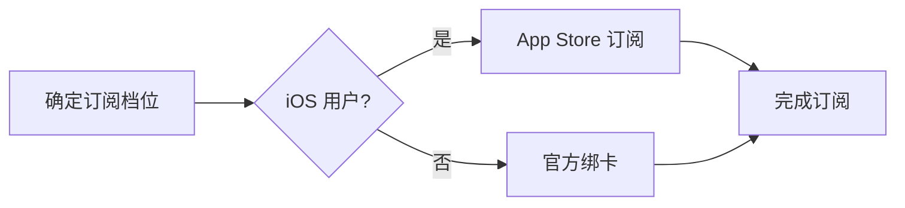

# ChatGPT 充值总览

国内用户想开通 ChatGPT Plus 或 Pro，目前常见的可行路径如下（按推荐优先级排序）：

## 方案对比

| 方案 | 难度 | 安全性 | 推荐指数 | 备注 |
|------|------|--------|----------|------|
| 官方绑卡 | 高 | 高 | ★★☆ | 需要支持地区的信用卡 |
| 苹果礼品卡 / App Store | 中 | 高 | ★★★★ | iOS 用户友好 |
| 可靠自助代充平台 | 低 | 中高 | ★★★★ | 选择不索要密码、有售后的平台 |
| 虚拟卡 | 高 | 中 | ★★☆ | 风控较高，容易失败 |

## 推荐阅读顺序

1. 先看 [Plus 与 Pro 区别对比](/chatgpt/recharge/plus-vs-pro)，选对档位
2. 再看 [Plus 订阅教程](/chatgpt/recharge/plus) 动手开通
3. 没有海外支付条件？看 [微信/支付宝开通教程](/chatgpt/recharge/gpt-daichong) 或 [苹果礼品卡教程](/chatgpt/recharge/apple-gift-card)
4. 有更高需求再看 [Pro 订阅说明](/chatgpt/recharge/pro)
5. 遇到问题查看 [常见问题](/chatgpt/faq)

::: warning 安全提醒
选择充值服务时，切勿向任何第三方提供账号密码与验证码；正规自助充值只需要注册邮箱。
:::

::: tip 推荐充值入口
充值中心支持微信 / 支付宝自助开通 ChatGPT Plus / Pro，无需账号密码，几分钟到账。
👉 [前往 AI 服务充值中心](https://littlemagic8.github.io/gptplus/index.html)
:::
