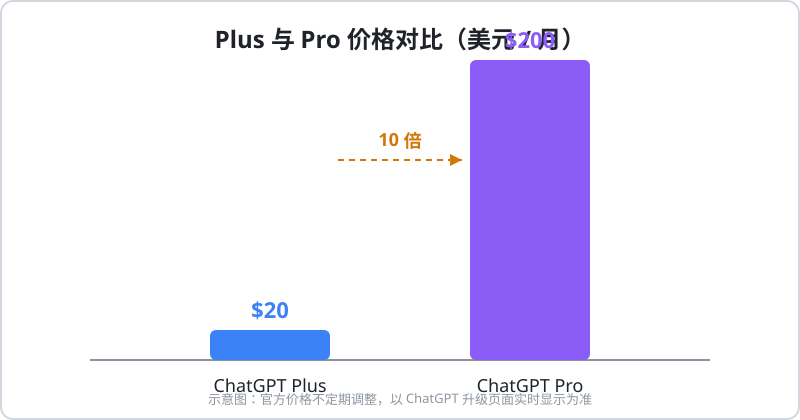
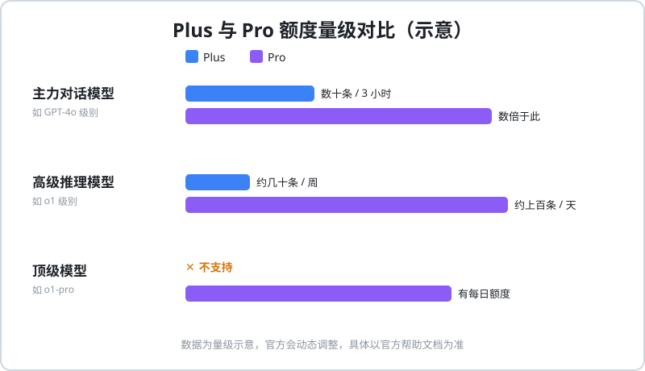
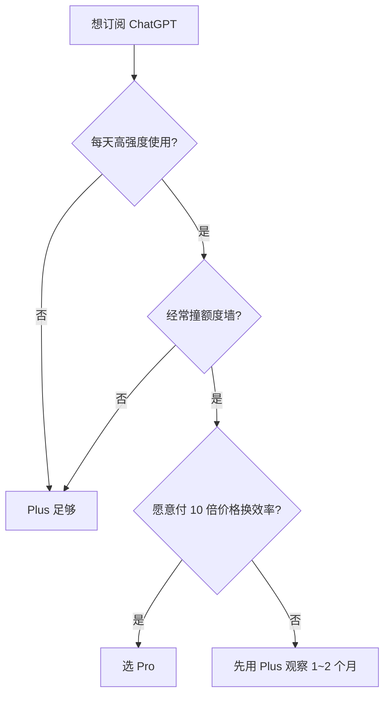

# ChatGPT Plus 与 Pro 区别对比

开通前最常见的问题就是：**Plus 和 Pro 到底差在哪？一个月 $200 的 Pro 值不值？** 本文从价格、模型额度、适用人群三个维度帮你一次看懂。

## 快速结论

| 对比项 | Plus | Pro |
|--------|------|-----|
| 月费 | $20 | $200 |
| 适合人群 | 绝大多数个人用户 | 高强度专业用户 |
| 主力与高级模型 | 可用，有额度限制 | 可用，额度大幅提升 |
| 顶级模型（如 o1-pro） | 不支持 | 支持 |
| 高峰期访问优先级 | 一般 | 更高 |

一句话总结：**绝大多数用户选 Plus 就够了**；只有当你每天高强度使用、频繁撞额度墙时，才值得考虑 Pro。

## 价格对比

- **Plus：$20/月**，年化约 $240
- **Pro：$200/月**，年化约 $2400，是 Plus 的 **10 倍**

::: warning 价格会变动
官方价格与权益不定期调整，下单前请以 ChatGPT 官方升级页面显示为准。
:::

## 额度对比（量级示意）

额度数值官方会动态调整，下图帮助你建立量级概念：

- **主力对话模型**：Plus 通常为每 3 小时数十条；Pro 数倍于此
- **高级推理模型**：Plus 一般按每周几十条计；Pro 通常达到每天上百条
- **顶级模型**：Plus 不支持；Pro 可用且有每日额度

## 怎么选？

## 升级与退订规则

- **Plus 升级 Pro**：差价按剩余订阅天数折算，升级即时生效
- **取消订阅**：当期权益保留至到期，一般不按天退款
- **Pro 不建议盲目开**：先用满 Plus 一段时间，确认额度确实是瓶颈再升级

## 开通方式

两个档位的支付入口相同，支付方式通用：

1. 已是 Plus 用户：左下角头像 → **Upgrade to Pro**
2. 新用户：先看 [ChatGPT Plus 订阅教程](/chatgpt/recharge/plus)
3. 苹果设备用户也可以走 [礼品卡订阅路线](/chatgpt/recharge/apple-gift-card)

::: tip 微信/支付宝直接开通
不想折腾海外支付？充值中心支持微信 / 支付宝自助开通 Plus / Pro，无需账号密码。
👉 [前往 AI 服务充值中心](https://littlemagic8.github.io/gptplus/index.html)
:::

开通或使用中遇到问题，可查看 [充值常见问题 FAQ](/chatgpt/faq)。
