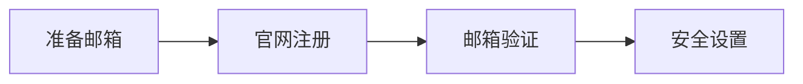

# ChatGPT 注册与账号完整教程

::: tip 时效说明
本文最后验证于 2026 年 9 月，流程可能随 OpenAI 政策变化，请以官方页面为准。
:::

## 准备工作

1. 一个可正常收信的邮箱（推荐 Gmail、Outlook，国内邮箱可能收不到验证码）
2. 稳定的网络环境（建议使用合规代理）
3. 手机号（部分情况下需要验证）

## 注册步骤

1. 打开官网 [https://chatgpt.com](https://chatgpt.com)
2. 点击 **Sign up**
3. 选择邮箱注册或使用 Google / Apple / Microsoft 账号登录
4. 填写邮箱并验证
5. 设置密码（建议使用密码管理器生成强密码）
6. 完成手机号验证（如要求）

## 流程示意

## 账号安全建议

| 措施 | 说明 |
| --- | --- |
| 开启两步验证（2FA） | 防止密码泄露后被盗 |
| 固定登录环境 | 降低风控触发概率 |
| 不用共享账号 | 共享是封号主因之一 |

::: warning 风险提示
不要在不可信第三方网站输入账号密码。
:::

## 常见问题

**Q：注册时提示不支持该地区？**
A：需要使用支持地区的网络环境访问。

**Q：收不到验证邮件？**
A：检查垃圾箱，或更换邮箱重试。
